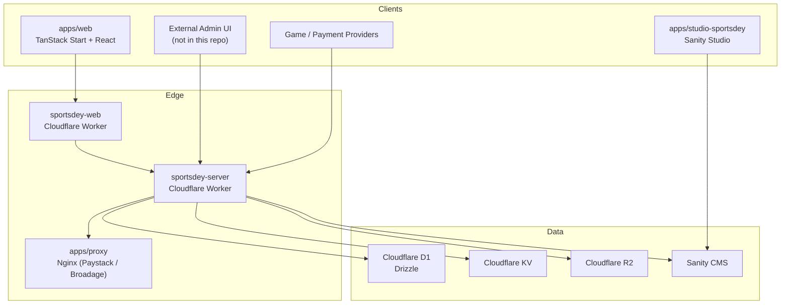
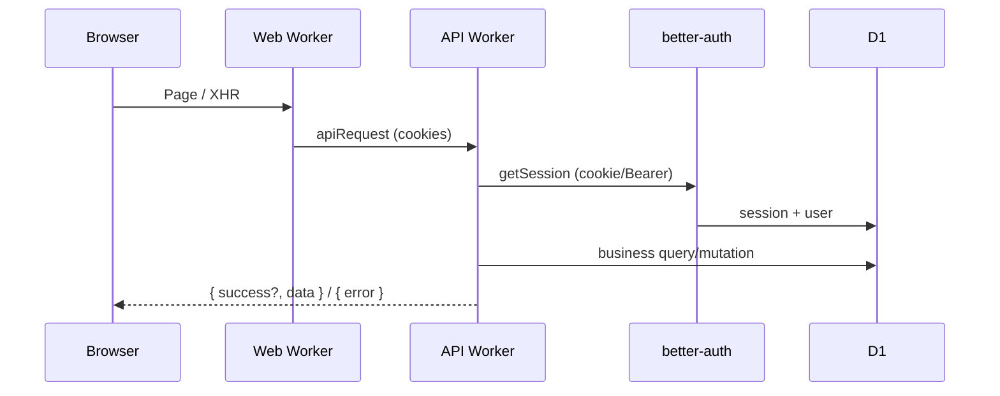
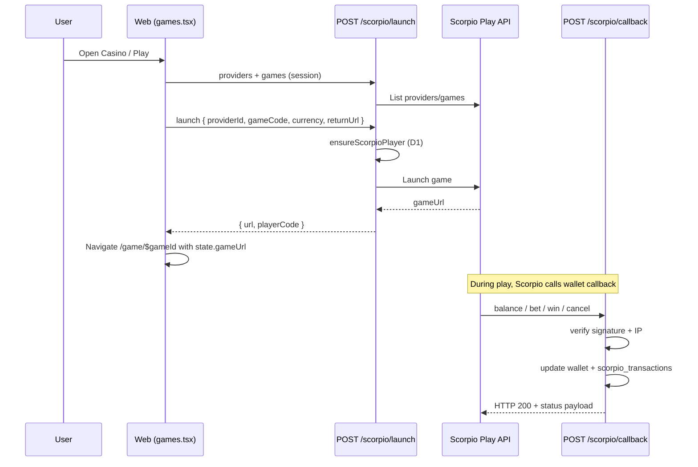
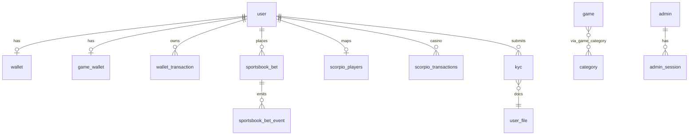
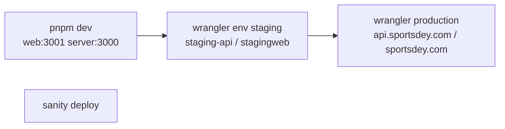

# Sportsdey — Project Documentation

> Onboarding reference for senior engineers. Derived from the repository as of the documentation date. **Do not treat this as a substitute for reading critical path code**; use it to navigate the system quickly.
>
> **Rules followed:** Only what exists in the repo is documented. Gaps and absences are called out explicitly. No secrets are included.

---

# Project Overview

## Purpose

**Sportsdey** is a Nigerian-facing online sports and gaming platform. The product combines:

- Live sports content (schedules, match info, standings, videos)
- Sportsbook betting (Data.Bet / Databet embedded SPA + wallet settlement)
- Casino / instant games (multiple providers, with **Scorpio Play** as the live catalog path on the Casino tab)
- Wallet funding, withdrawals, P2P transfers, and bill payments
- News, promotions, and CMS-driven content (Sanity)
- KYC, notifications, and an admin back-office API

## Business Domain

| Domain | Description |
|--------|-------------|
| Sports media | Football, basketball, tennis (+ boxing/UFC landing shells on web) |
| Sportsbook | Bets, freebets, bet-boosts; stake freeze/settle against user wallet |
| Casino | Multi-provider game launch + seamless wallet callbacks |
| Payments | Paystack deposits/withdrawals; Monnify utility bills |
| Compliance | KYC document upload/review; account suspension |
| Ops | Admin roles/permissions, withdrawals approval, tickets, CMS |

## Major Features

1. **Auth** — Email/password, Google/Facebook OAuth, phone OTP (Africa’s Talking)
2. **Wallet** — Main wallet (kobo), game wallet, Paystack fund/withdraw, transfers
3. **Sportsbook** — Databet widget/SPA; server bet lifecycle APIs
4. **Casino** — Scorpio Play live catalog + launch; also Slotegrator, Thndr, Lagos Rush, Spribe/Lucky World paths on the API
5. **Content** — Sanity news, banners, promos; YouTube videos
6. **Admin API** — Separate admin auth, permissions, player tooling
7. **CMS Studio** — Sanity Studio app for content editors

## High-Level Architecture



**Monorepo shape:** pnpm workspaces + Turborepo. Runtime DB and API live in `apps/server` (not a separate `packages/db`). Root README still mentions `packages/api` and native app scripts that **do not exist** in this tree.

---

# Tech Stack

| Technology | Where | Why it exists |
|------------|-------|----------------|
| **TypeScript** | Entire monorepo | Shared language / type safety |
| **pnpm** + **Turborepo** | Root | Workspace installs and task orchestration |
| **Biome** | Root | Lint + format (replaces ESLint/Prettier) |
| **React 19** | `apps/web`, studio | UI |
| **TanStack Start** | `apps/web` | SSR + file routing on Cloudflare |
| **TanStack Router** | `apps/web` | File-based routes (`routeTree.gen.ts`) |
| **TanStack Query** | `apps/web` | Server-state caching (games, sports, wallet) |
| **TanStack Form** | `apps/web` | Forms (dependency present) |
| **Vite 7** | `apps/web` | Dev server + build |
| **Tailwind CSS v4** | `apps/web` | Styling |
| **shadcn/ui + Radix** | `apps/web` | Primitive UI components |
| **Redux Toolkit** | `apps/web` | Sport UI filters / date / toast helpers |
| **Framer Motion / Swiper / Embla** | `apps/web` | Motion and carousels |
| **better-auth** | web + server | End-user authentication |
| **Hono** + **@hono/zod-openapi** | `apps/server` | HTTP API + OpenAPI |
| **Zod** | server (+ web) | Validation / OpenAPI schemas |
| **Drizzle ORM** | `apps/server` | Typed SQL against D1 |
| **Cloudflare Workers** | web + server | Runtime / deploy target |
| **Wrangler** | web + server | Dev + deploy |
| **Cloudflare D1** | server | Primary database (SQLite) |
| **Cloudflare KV** | server | Sports schedule / response caching |
| **Cloudflare R2** | server | File / KYC / avatar storage |
| **Sanity** | studio + server | CMS content |
| **Paystack** | server (+ proxy) | Deposits, bank resolve, transfers |
| **Monnify** | server | Bill payments |
| **Africa’s Talking** | server | SMS OTP |
| **WebEngage** | web + server | Product analytics / CRM events |
| **Data.Bet (Databet)** | web + server | Sportsbook UI + settlement APIs |
| **Scorpio Play** | server (+ web catalog) | Casino aggregation / seamless wallet |
| **Slotegrator / Thndr / Lagos Rush / Spribe** | server | Additional casino integrations |
| **API-Sports / YouTube** | server | Sports data and match videos |
| **Nginx** | `apps/proxy` | Ops reverse proxy (not app runtime) |
| **Node test runner + tsx** | server | Unit tests (Scorpio helpers) |

**Not present (despite common assumptions or outdated README):** Next.js, FastAPI, PostgreSQL, Prisma, Redis as a product cache, Docker/Compose, GitHub Actions CI, Flutterwave, dedicated email provider (SendGrid/etc.), `apps/native`, `packages/db`, `packages/api`.

---

# Repository Structure

```
sportsdey/
├── apps/
│   ├── server/           # Hono API on Cloudflare Workers + D1
│   ├── web/              # Public TanStack Start frontend
│   ├── studio-sportsdey/ # Sanity Content Studio
│   └── proxy/            # Nginx configs only (no package.json)
├── packages/
│   └── config/           # Shared tsconfig base (@sportsdey/config)
├── docs/                 # Casino provider design notes
├── temp_puppeteer/       # Ad-hoc scripts (not product runtime)
├── biome.json
├── turbo.json
├── pnpm-workspace.yaml
├── package.json
├── README.md
├── casino_game_flow.md
└── PROJECT_DOCUMENTATION.md  # this file
```

## `apps/server/`

| Path | Purpose | Responsibilities | Depends on |
|------|---------|------------------|------------|
| `src/index.ts` | App entry | CORS, logger, better-auth mount, session middleware, route mounts, OpenAPI/Swagger | Hono, auth, all routes |
| `src/routes/` | HTTP controllers | One module per domain; Zod OpenAPI routes | schemas, utils, db, auth |
| `src/routes/route.ts` | Public router aggregator | Mounts public prefixes | route modules |
| `src/schemas/` | OpenAPI/Zod contracts | Request/response shapes | zod |
| `src/validators/` | Extra Zod validators | Football/basketball/tennis/news/monnify | zod |
| `src/utils/` | Integration helpers | Paystack, Monnify, Scorpio, Slotegrator, SMS, fetch timeout, UUID | env bindings |
| `src/lib/` | Cross-cutting libs | Sanity client, WebEngage, image helpers | Sanity, WebEngage APIs |
| `src/auth/` | Auth factories | better-auth config; admin session helpers | Drizzle, better-auth |
| `src/middleware/` | Admin permission guards | `requirePermission` / `requireAny` / `requireAll` | permissions, admin auth |
| `src/permissions/` | Permission catalog | Named permission strings | — |
| `src/db/` | ORM + migrations | `schema.ts`, `schema/admin.ts`, `migrations/` | drizzle-orm, D1 |
| `src/cli/` | Ops scripts | Seed/sync games, Dropbox, admins, categorize | DB, external APIs |
| `wrangler.jsonc` | Worker config | D1/KV/R2/mTLS, staging/prod routes | Cloudflare |
| `.env.example` | Env documentation | Variable names for local/prod secrets | — |

**No classic “repository” layer.** Routes call Drizzle directly (or thin utils). There is no DI container.

## `apps/web/`

| Path | Purpose | Responsibilities | Depends on |
|------|---------|------------------|------------|
| `src/routes/` | Pages / file routes | Screens + loaders | router, API, components |
| `src/components/` | UI features + shadcn `ui/` | Layout, modals, sport sections | React, Tailwind |
| `src/shared/` | Sport card primitives | Accordion/match cards | — |
| `src/hooks/` | Domain hooks | Schedules, news, favorites, unread | React Query / Redux |
| `src/lib/` | Client libraries | `api`, auth, scorpio-catalog, sportsbook, KYC, CMS helpers | server API |
| `src/store/` | Redux store | Sport filters, date, notifications toasts | RTK |
| `src/services/` | RTK Query APIs | `basketballApi` (placeholder base URL) | RTK Query |
| `src/worker.ts` | CF SSR entry | Start handler | TanStack Start |
| `public/` | Static assets | Images, placeholders | — |

## `apps/studio-sportsdey/`

Sanity Studio for banners, news, promos, authors, comments (`schemaTypes/`).

## `apps/proxy/`

Nginx reverse proxy configuration for Broadage and Paystack-style proxying. Not a Node package; ops artifact.

## `packages/config/`

Shared TypeScript base config (`tsconfig.base.json`) consumed as `@sportsdey/config`.

## `docs/`

Architectural notes for casino providers (`casino-provider.md`, `casino-providers.md`). Informative; may lag code.

---

# System Architecture

## Frontend flow

1. Browser hits Cloudflare Worker for `apps/web` (SSR via TanStack Start).
2. Client hydrates; `__root.tsx` installs ThemeProvider (forced dark), Redux, React Query, layout (header/sidebar/footer).
3. Pages call `apiRequest` / better-auth / Scorpio helpers with `credentials: "include"`.
4. Casino and wallet features gate on `useSession()`.

## Backend flow

1. Request hits `api.sportsdey.com` / `staging-api.sportsdey.com` Worker.
2. CORS + logger → `/auth/*` or business routes.
3. Global middleware attaches better-auth `user`/`session` (with skip list for auth, docs, provider callbacks, admin).
4. Handlers validate with Zod, touch D1/KV/R2, call external APIs (often via `PROXY_URL`).

## Request lifecycle (typical authenticated API call)



## Authentication flow (end user)

See [Authentication](#authentication).

## Game launch flow (Scorpio — current Casino UI)



## Database interactions

- All persistence via **Drizzle on D1**.
- Migrations in `apps/server/src/db/migrations` (`0000`–`0024`).
- Amounts are generally stored in **kobo** (integer) on wallet tables.

## External API interactions

Outbound calls are concentrated in `src/utils/*` and route handlers. Several payment/sportsbook calls go through an authenticated **proxy** (`PROXY_URL` + `PROXY_SECRET`) rather than directly from the Worker.

---

# Authentication

## End-user auth (better-auth)

**Server:** `apps/server/src/auth/index.ts`  
**Client:** `apps/web/src/lib/auth/client.ts`  
**Mount:** `GET|POST /auth/*`

| Mechanism | Details |
|-----------|---------|
| Email/password | Enabled |
| OAuth | Google, Facebook (Apple config commented) |
| Plugins | Expo, OpenAPI, Bearer |
| Session storage | D1 tables `session`, `account`, `user`, `verification` |
| Cookies | Prefix `ba`; cross-subdomain via `COOKIE_DOMAIN`; Secure outside development |
| Bearer | Supported for API clients |
| Extra user fields | `country`, `mobileNumber`, `verificationStatus`, `lastLoginIp`, `suspended` |

**Phone OTP** (`/phone-auth/*`): Africa’s Talking SMS; OTP stored in `verification`; successful verify creates better-auth-compatible session cookies.

**Token lifecycle:** Session rows with `expiresAt`. No separate “refresh token” product surface was found beyond better-auth’s session model. Exact TTL values live in better-auth config—consult `src/auth/index.ts` for current settings.

**Frontend:** `useSession()`, `signIn` / `signUp` / `signOut`, OAuth `callbackURL` using `VITE_PUBLIC_URL`.

## Admin auth (custom)

**Files:** `apps/server/src/auth/admin.ts`, tables `admin`, `admin_session`

- Password hashing: scrypt (`@noble/hashes`)
- Session token: random hex; cookie `admin_session` **or** `Authorization: Bearer`
- TTL: **7 days** (with last-active touch)
- Roles: `super_admin` | `admin` | `csr-admin`
- `super_admin` **bypasses** permission checks

## Middleware / guards

| Layer | Behavior |
|-------|----------|
| Global better-auth | Sets `c.set("user"|"session")`; skips `/auth`, `/docs`, `/openapi`, `/account` (Spribe), `/scorpio/callback`, `/admin` |
| Route-level | Many handlers require `c.get("user")` |
| Admin | `validateAdminSession` + `requirePermission` / `requireAny` / `requireAll` |
| Provider callbacks | Provider-specific HMAC / API key / signature — **not** user sessions |

There is **no** named end-user RBAC enum; authorization for players is “authenticated + not suspended + KYC where required.”

---

# Database

## ORM & migrations

- **ORM:** Drizzle (`drizzle-orm/d1`)
- **Schema:** `apps/server/src/db/schema.ts` + `schema/admin.ts`
- **Migrations:** `0000_premium_lady_vermin` … `0022_burly_fat_cobra`, plus `0023_scorpio_players`, `0024_scorpio_transactions`
- **Config:** `apps/server/drizzle.config.ts` (sqlite / D1)
- **Repository pattern:** Not used; handlers query Drizzle directly

## Core tables (summary)

| Table | Role |
|-------|------|
| `user`, `session`, `account`, `verification` | better-auth identity |
| `wallet`, `wallet_transaction` | Main money + ledger (kobo; `frozenBalance` for sportsbook) |
| `game_wallet`, `game_wallet_transaction` | Separate game wallet |
| `withdrawal_account` | Bank accounts for payouts |
| `utility_transaction` | Monnify bill vends |
| `sportsbook_bet`, `sportsbook_bet_event` | Databet bet lifecycle |
| `game`, `category`, `game_category` | Local game catalog (admin/CLI; Casino UI now uses Scorpio live API) |
| `game_launch_tokens`, `game_sessions`, `game_transactions` | Spribe / Lucky World |
| `thundr_sessions`, `thundr_transactions` | Thndr |
| `slotitegration_sessions`, `slotitegration_transactions` | Slotegrator |
| `pockets_transactions` | Lagos Rush pockets wallet |
| `scorpio_players`, `scorpio_transactions` | Scorpio player map + wallet txs |
| `user_file`, `kyc` | Uploads + KYC |
| `user_notification` | In-app notifications |
| `gdrive_file` | Image catalog helper |
| `admin`, `admin_session`, `admin_notification`, `admin_log_note` | Admin domain |

### Relationships (conceptual)



### Indexes / uniqueness (notable)

Exact indexes are defined in schema and migrations. Patterns observed in code:

- Unique wallet `userId`
- Unique transaction references / provider `transactionId` columns (idempotency)
- Unique `category.slug`
- `scorpio_players.userId` as PK; unique Scorpio `transactionId`

---

# API Documentation

Base URLs (from Wrangler / README):

| Env | API host | Web host |
|-----|----------|----------|
| Local | `http://localhost:3000` | `http://localhost:3001` |
| Staging | `staging-api.sportsdey.com` | `stagingweb.sportsdey.com` |
| Production | `api.sportsdey.com` | `sportsdey.com` |

**Response conventions (typical):**

- Success: `{ success?: true, data: T }` (some routes return `data` only via OpenAPI envelope)
- Error: `{ success: false, error: string, details?: …, code?: string }`
- Provider callbacks often use **provider-specific** envelopes (Scorpio/Slotegrator/Thndr)

**Interactive docs:** `GET /docs` (Swagger UI), `GET /openapi.json`

> Full OpenAPI is the source of truth for schemas. Below is a navigable inventory grouped by mount. Auth column: **User** = better-auth session; **Admin** = admin session; **Provider** = provider credentials; **Public** = none / partial.

## Auth & docs

| Method | Path | Purpose | Auth |
|--------|------|---------|------|
| * | `/auth/*` | better-auth (sign-in, OAuth, session, …) | Public / session |
| GET | `/docs` | Swagger UI | Public |
| GET | `/openapi.json` | OpenAPI document | Public |

## Phone auth `/phone-auth`

| Method | Path | Purpose | Auth |
|--------|------|---------|------|
| POST | `/phone-auth/request-otp` | Send SMS OTP | Public |
| POST | `/phone-auth/verify-otp` | Verify OTP; create session | Public |

**Errors:** invalid phone, OTP expired/mismatch, SMS provider failures.

## Wallet `/wallet`

| Method | Path | Purpose | Auth | Dependencies |
|--------|------|---------|------|--------------|
| POST | `/wallet/fund` | Init Paystack deposit | User | Paystack, `wallet_transaction` |
| GET | `/wallet/` | Get/create main wallet | User | D1 |
| GET | `/wallet/transactions` | History | User | D1 |
| GET | `/wallet/banks` | Nigerian banks | User | Paystack |
| GET | `/wallet/callback` | Paystack return; verify & credit | Public (Paystack redirect) | Paystack |
| POST | `/wallet/withdraw` | Request withdrawal | User + KYC approved | D1, admin notify |
| POST | `/wallet/transfer` | P2P transfer | User | D1 |
| POST/GET/DELETE | `/wallet/accounts`… | Withdrawal bank accounts | User | Paystack resolve |
| GET | `/wallet/game-wallet` | Game wallet | User | D1 |
| POST | `/wallet/transfer-to-game` | Main → game wallet | User | D1 |

**Errors:** unauthorized, insufficient balance, KYC not approved, Paystack failures, duplicate references.

## User `/user`

| Method | Path | Purpose | Auth |
|--------|------|---------|------|
| GET/PATCH | `/user/` | Profile self | User |
| GET | `/user/all` | List users | Admin |
| POST | `/user/` | Create user | Admin |
| GET | `/user/{userId}/profile` | Player profile | Admin |
| PATCH | `/user/{userId}/suspended` | Suspend | Admin |
| GET | `/user/{userId}/wallet/overview` | Wallet overview | Admin |
| GET | `/user/{userId}/wallet/transactions` | Wallet txs | Admin |
| POST | `/user/{userId}/wallet/manual` | Manual credit/debit | Admin + permission |

## Sports data

### Football `/football`

| Method | Path | Purpose | Auth | Notes |
|--------|------|---------|------|-------|
| GET | `/football/{status}` | Schedule by status/date | Public | API-Sports + KV |
| GET | `/football/tournament/{tournamentId}` | Tournament schedule | Public | |
| GET | `/football/match/{id}` | Match info | Public | |
| GET | `/football/match/{id}/stats` | Match stats | Public | |
| GET | `/football/standings/{tournamentId}` | Standings | Public | |
| GET | `/football/videos` | YouTube videos | Public | |

### Basketball `/basketball` & Tennis `/tennis`

Analogous schedule / game / standings / videos endpoints (see route files). Auth: Public. Deps: API-Sports, YouTube, KV.

### News `/news`

| Method | Path | Purpose |
|--------|------|---------|
| GET | `/news/videos` | YouTube videos for news query |

## Notifications `/notifications`

| Method | Path | Purpose | Auth |
|--------|------|---------|------|
| GET | `/notifications/` | List | User |
| GET | `/notifications/unread-count` | Unread | User |
| GET | `/notifications/{id}` | Detail | User |
| POST | `/notifications/{id}/read` | Mark read | User |
| POST | `/notifications/send` | Send to user | Admin |
| POST | `/notifications/ticket-status` | Betstack webhook → notification | Provider/webhook |

## Casino providers

### Local games catalog `/games`

CRUD for `game` / categories (admin writes; public list). **Note:** Web Casino tab currently loads **Scorpio live catalog**, not this table.

### Scorpio `/scorpio`

| Method | Path | Purpose | Auth |
|--------|------|---------|------|
| POST | `/scorpio/launch` | Launch game URL | User |
| POST | `/scorpio/kick` | Kick player | User (self) / constrained |
| GET | `/scorpio/providers` | List providers | User |
| GET | `/scorpio/providers/settings` | Settings | User |
| GET | `/scorpio/providers/{providerId}/settings/{currency}` | Currency settings | User |
| GET | `/scorpio/games/{providerId}` | Games for provider | User |
| GET | `/scorpio/player` | Player info | User |
| GET/POST/PATCH | `/scorpio/operator` | Operator proxy | Admin (`super_admin` for create/update) |
| GET | `/scorpio/transactions` | List txs | User/admin per handler |
| GET | `/scorpio/transactions/round` | Round txs | — |
| POST | `/scorpio/bonus-call/register` | Register bonus | — |
| POST | `/scorpio/bonus-call/cancel` | Cancel bonus | — |
| GET | `/scorpio/bonus-call/{issueId}` | Bonus detail | — |
| POST | `/scorpio/callback` | Seamless wallet | Provider (HMAC + IP) |
| GET | `/scorpio/callback` | Health | Public |

**Launch request (typical):** `{ providerId, gameCode, language?, currency?, returnUrl?, rtp? }`  
**Launch response:** `{ data: { url, playerCode } }`  
**Callback commands:** `balance` | `bet` | `win` | `cancel` — prefers **HTTP 200** with provider status codes even on logical errors.

### Slotegrator `/slotegrator`

| Method | Path | Purpose | Auth |
|--------|------|---------|------|
| POST | `/slotegrator/launch` | Launch | User |
| POST | `/slotegrator/` | Wallet actions `balance|bet|win|refund|rollback` | Provider signature |

### Thndr `/thndr`

| Method | Path | Purpose | Auth |
|--------|------|---------|------|
| POST | `/thndr/play/{gameId}` | Launch | User |
| GET | `/thndr/sessions/{sessionToken}` | Validate session | Provider HMAC |
| POST | `/thndr/transactions` | Bet/win/refund | Provider HMAC |
| GET | `/thndr/users/{userId}/balance` | Balance | Provider HMAC |

### Lagos Rush `/lagos-rush` + Pockets `/pockets`

| Method | Path | Purpose | Auth |
|--------|------|---------|------|
| POST | `/lagos-rush/launcher` | Launch | User |
| POST | `/pockets/balance|debit|credit|refund` | Wallet callbacks | API key |

### Spribe / Lucky World `/casino` + `/account`

| Method | Path | Purpose | Auth |
|--------|------|---------|------|
| POST | `/casino/play/{gameCode}` | Issue launch token / URL | User |
| GET | `/casino/transactions` | History | User |
| POST | `/account/auth` | Validate launch token | Provider |
| POST | `/account/withdraw_spribe` | Bet debit | Provider |
| POST | `/account/deposit_spribe` | Win credit | Provider |
| POST | `/account/rollback_spribe` | Rollback | Provider |
| POST | `/account/player_info` | Player/balance | Provider |

### Hashcodex `/hashcodex`

| Method | Path | Purpose | Auth |
|--------|------|---------|------|
| POST | `/hashcodex/deposit` | Credit/debit wallet (kobo) | User |

## Sportsbook `/sportsbook`

| Method | Path | Purpose | Auth |
|--------|------|---------|------|
| POST | `/sportsbook/token/create` | Databet session token | User |
| POST | `/sportsbook/heartbeat` | Session heartbeat | Databet (`Foreign-Params`) |
| POST | `/sportsbook/bet/place|accept|decline|settle|unsettle` | Bet lifecycle | Databet |
| POST | `/sportsbook/bet/cash-out-orders/accepted|declined` | Cash-out | Databet |
| POST/GET/PUT/DELETE | `/sportsbook/freebet…` | Freebet admin APIs | Admin |
| POST/GET/PUT/DELETE | `/sportsbook/bet-boost…` | Bet boost admin APIs | Admin |

## Bills `/bills` (Monnify)

| Method | Path | Purpose | Auth |
|--------|------|---------|------|
| GET | `/bills/categories|billers|products` | Catalog | User (as implemented) |
| POST | `/bills/vend` | Validate + vend (wallet debit) | User |
| GET | `/bills/requery` | Status requery | User |
| GET | `/bills/history` | History | User |

## Files `/files`

Upload/list/get/delete user files on R2. Auth: User.

## KYC `/kyc`

| Method | Path | Purpose | Auth |
|--------|------|---------|------|
| POST/GET | `/kyc/` | Submit / own status | User |
| GET | `/kyc/all`, `/kyc/{kycId}` | Admin review list/detail | Admin |
| POST | `/kyc/{kycId}/approve|reject|review` | Review actions | Admin |

## CMS `/cms`

Public news/banners/promos/comments under `/cms/public/…`. Admin content CRUD under `/cms/content…` and authors (admin-cms). Auth varies by route.

## Admin `/admin`

Includes: admin sign-in/out, password change, devices, me/profile, admin CRUD, permissions, wallet transactions, withdrawals approve/reject, tickets, ticket overview, log notes, admin notifications, overview stats/activity/top-bets.

**Critical ops:** Withdrawal approve/reject restricted to `super_admin` in handlers.

---

# Integrations

## Scorpio Play

| Aspect | Detail |
|--------|--------|
| Architecture | Main API proxy (`utils/scorpio.ts`) + Seamless Wallet callback (`scorpio-callback.ts`) |
| Auth (outbound) | `SCORPIO_API_TOKEN` |
| Auth (inbound callback) | HMAC-SHA512 `X-Request-Signature` + optional IP allowlist |
| Config | `SCORPIO_API_URL` / `SCORPIO_BASE_URL`, `SCORPIO_CALLBACK_URL`, `SCORPIO_SERVER_IP`, `SCORPIO_ALLOWED_IPS` |
| Frontend | `apps/web/src/lib/scorpio-catalog.ts` aggregates providers→games; launch via `/scorpio/launch` |
| Retries | Not a generic retry framework; provider-level failures on catalog fetch are swallowed per provider (except 401) |
| Errors | Mapped via `ScorpioApiError` / `scorpioErrorToHttpStatus`; callback prefers HTTP 200 |

## Data.Bet (Sportsbook)

| Aspect | Detail |
|--------|--------|
| Frontend | Bootstrap script + widgets (`lib/sportsbook.ts`); full SPA at `/sportsbetting/$` |
| Backend | Token create; bet place/accept/decline/settle/cash-out; freebet/boost admin |
| Auth | User session for token; Databet `Foreign-Params` for wallet ops; outbound via proxy + mTLS cert binding `DATABET_CERT` |
| Wallet | Freeze/unfreeze/settle against `wallet.frozenBalance` + `sportsbook_bet` |

## Paystack

| Aspect | Detail |
|--------|--------|
| Uses | Deposit init/verify, banks, resolve account, transfer on withdrawal approve |
| Auth | `PAYSTACK_SECRET_KEY` (often via `PROXY_URL`) |
| Callback | `GET /wallet/callback` (redirect). Webhook route exists **commented out** |

## Monnify

Bill categories/billers/products/vend/requery. OAuth-style client credentials → access token. Debits main wallet; records `utility_transaction`.

## Slotegrator

Launch + single callback endpoint with signed actions. Tables `slotitegration_*`. CLI sync tools under `src/cli/`.

## Thndr

Launch + HMAC-authenticated session/transaction/balance endpoints. Tables `thundr_*`.

## Lagos Rush (Minigod) + Pockets

User launch with API key; provider hits `/pockets/*` with `POCKETS_SECRET_KEY`.

## Spribe / Lucky World Games

One-time `game_launch_tokens`; `/account/*` seamless endpoints; `LUCKYWORLDGAMES_LAUNCH_URL`.

## Africa’s Talking

SMS OTP for phone auth.

## WebEngage

Server: `lib/webengage.ts` fire-and-forget events/attributes (`waitUntil` when available).  
Client: `lib/webengage.ts` login/logout/track.

## Sanity CMS

Read/write clients; public CMS routes + admin CMS + Studio app.

## API-Sports / YouTube

Sports schedules/stats; match/news videos. Cached in KV where implemented.

## Dropbox → R2

CLI-only sync for game images (`DROPBOX_*`, `R2_*`).

## Hashcodex

In-app authenticated wallet mutate endpoint — not a third-party payment gateway.

**Flutterwave / dedicated email ESP:** not found.

---

# Frontend

## Routing

File-based TanStack Router under `apps/web/src/routes/`. Generated tree: `routeTree.gen.ts`. Default pending = `Loader`; default not-found = simple “Not Found”.

Major areas: sports landings, sportsbook splat, casino (`/games`, `/game/$gameId`, `/play/$gameName`), wallet, KYC, auth layout, news, promotions, legal pages.

## Layouts

`__root.tsx`: global providers, forced dark theme, ErrorBoundary, header/sidebar/footer, WebEngage hooks, sports search param validation.

Auth routes under `auth/_layout.tsx`.

## State management

| Layer | Use |
|-------|-----|
| React Query | Server data (default stale 10s / gc 50s); casino `["scorpio-games"]` stale 60s |
| Redux | Sport UI filters, selected date, toast actions |
| Context | Date, active tab, current filter |
| localStorage | Favorites, current sport |

## API consumption

Central `apiRequest` in `lib/api.ts` (10s timeout, `{ data }` unwrap, `ApiError`). Authenticated calls must pass `credentials: "include"` (callers’ responsibility). Scorpio helpers use `apiRequest` with credentials.

## Hooks

See `apps/web/src/hooks/` — football schedule polling, match info, news infinite queries, favorites, unread notifications, API error → toast, etc.

## Caching / loading / errors

- React Query cache + KV on server for sports
- Skeletons, `Loader2`, `EmptyState`, `ErrorState`, Sonner toasts
- Class `ErrorBoundary` at root
- Casino: sign-in CTA when logged out; retry on catalog failure

## Casino UI specifics

- Live Scorpio catalog only on Casino surfaces (no hardcoded game list)
- Dynamic categories from API; **All Games** first
- Search: name / provider / category
- Launch navigates to iframe host with `state.gameUrl`

---

# Backend

## Style

- **Controllers:** Hono OpenAPI route modules
- **Services:** Informal — logic in routes + `utils/` + `lib/`
- **Repositories:** None
- **DI:** None (Cloudflare `c.env` bindings + imports)
- **Validation:** Zod OpenAPI + occasional `safeParse`
- **Config:** Wrangler vars + secrets (`.dev.vars` locally); `getScorpioConfig` etc. for typed subsets

## Middleware

CORS (credentials + allowlist including mobile deep-link schemes), logger, better-auth session injection, admin permission helpers.

## Business logic hotspots

| Domain | Location |
|--------|----------|
| Wallet fund/withdraw/transfer | `routes/wallet.ts`, `utils/paystack.ts` |
| Sportsbook settlement | `routes/sportsbook.ts` |
| Scorpio seamless wallet | `utils/scorpio-callback.ts` |
| Admin withdrawals | `routes/admin-withdrawals.ts` |
| KYC | `routes/kyc.ts` |

---

# Data Flow

## User login (email / OAuth)

```
User → /auth/sign-in or OAuth → better-auth → D1 session/user
     → Set ba.* cookies (shared via COOKIE_DOMAIN)
     → Frontend useSession() sees user
     → Optional WebEngage identify
```

## Phone login

```
request-otp → Africa’s Talking SMS → verification row
verify-otp → create/find user → session cookies → frontend
```

## Deposit

```
POST /wallet/fund → pending wallet_transaction → Paystack initialize
→ User pays → GET /wallet/callback → verify → credit wallet → redirect frontend
```

## Withdrawal

```
POST /wallet/withdraw (KYC approved) → debit + pending_approval → notify super_admin
→ POST /admin/withdrawals/{id}/approve → Paystack transfer
  or reject → refund wallet
```

## Game launch (Scorpio)

```
Frontend catalog fetch → POST /scorpio/launch → ensure player → Scorpio launch API
→ URL → iframe /game/$gameId
```

## Wallet callback (Scorpio)

```
Scorpio → POST /scorpio/callback → IP + signature checks
→ balance | bet | win | cancel → unique transaction claim → wallet update
→ HTTP 200 response envelope
```

## Sportsbook bet

```
Frontend Databet UI → token/create → place (freeze) → accept/decline → settle/cash-out
→ wallet + sportsbook_bet(+events)
```

---

# Environment Variables

## Server (`apps/server/.env.example` + code references)

| Variable | Required? | Purpose |
|----------|-----------|---------|
| `CLOUDFLARE_ACCOUNT_ID` | For remote D1 tooling | Cloudflare account |
| `CLOUDFLARE_DATABASE_ID` | For remote D1 tooling | D1 database id |
| `CLOUDFLARE_D1_TOKEN` | For remote D1 tooling | API token |
| `BETTER_AUTH_SECRET` | **Yes** (prod) | Auth signing secret |
| `BETTER_AUTH_URL` | **Yes** | Auth base URL |
| `CORS_ORIGIN` | **Yes** (prod) | Allowed web origin |
| `COOKIE_DOMAIN` | **Yes** (prod multi-subdomain) | Shared cookie domain (e.g. `sportsdey.com`) |
| `SERVER_URL` | Recommended | Absolute server URL for callbacks |
| `PAYSTACK_SECRET_KEY` | For payments | Paystack secret |
| `PAYSTACK_PUBLIC_KEY` | Frontend-adjacent | Paystack public |
| `AFRICASTALKING_API_KEY` / `USERNAME` / `SENDER_ID` | Phone auth | SMS |
| `LAGOS_RUSH_API_KEY` / `LAGOS_RUSH_BASE_URL` | Lagos Rush | Launch |
| `POCKETS_SECRET_KEY` | Lagos Rush callbacks | API key auth |
| `SCORPIO_API_URL` / `SCORPIO_BASE_URL` | Scorpio | API host |
| `SCORPIO_API_TOKEN` | Scorpio | Bearer/token |
| `SCORPIO_CALLBACK_URL` | Scorpio | Registered operator callback |
| `SCORPIO_SERVER_IP` / `SCORPIO_ALLOWED_IPS` | Scorpio callback | IP allowlist |
| `PROXY_URL` / `PROXY_SECRET` | Many outbound calls | Authenticated egress proxy |
| `WEBENGAGE_API_KEY` / `API_SECRET` / `LICENSE_CODE` (+ `HOST` in code) | Analytics | WebEngage |
| `DROPBOX_ACCESS_TOKEN` / `DROPBOX_SHARED_LINK` | CLI | Image sync |
| `R2_ACCESS_KEY_ID` / `SECRET` / `ENDPOINT` / `BUCKET_NAME` / `PUBLIC_URL` | CLI / S3-style | R2 access |
| `GOOGLE_CLIENT_ID` / `SECRET` | OAuth | Google |
| `FACEBOOK_CLIENT_ID` / `SECRET` | OAuth | Facebook |
| `YOUTUBE_API_KEY` | Videos | YouTube Data API |
| `API_SPORTS_KEY` | Sports data | API-Sports |
| `STATSCORE_TOKEN` / `BROADAGE_API_KEY` | Legacy/partial | Sports feeds (Statscore routes commented) |
| `LUCKYWORLDGAMES_LAUNCH_URL` | Spribe path | Launch base |
| `MONNIFY_API_KEY` / `CLIENT_SECRET` / `CONTRACT_CODE` | Bills | Monnify |
| `THNDR_BASE_URL` / `OPERATOR_ID` / `SERVER_SECRET` | Thndr | Integration |
| `SLOTITEGRATION_MERCHANT_ID` / `MERCHANT_KEY` / `SLOTEGRATOR_API_URL` | Slotegrator | Integration |
| `SANITY_WRITE_TOKEN` / `SANITY_WRITE_TOKEN_COMMENT` | CMS writes | Sanity |
| `NODE_ENV` | Runtime | `development` / `staging` / `production` |

**Bindings (Wrangler, not classic env):** `DB` (D1), KV namespaces, R2 buckets, `DATABET_CERT` (mTLS).

## Web (`apps/web/.env.example` + code)

| Variable | Required? | Purpose |
|----------|-----------|---------|
| `VITE_SERVER_URL` | **Yes** | API base + better-auth baseURL |
| `VITE_API_URL` | Optional fallback | Alternate API base |
| `VITE_PUBLIC_URL` | OAuth / OG | Public site URL |
| `VITE_DATABET_SPA_BOOTSTRAP_SCRIPT` | Sportsbook | Bootstrap script URL |
| `VITE_DATABET_SPA_BASENAME` | Sportsbook | SPA basename |
| `VITE_DATABET_DEFAULT_LOCALE` | Optional | Default `en` |

---

# Error Handling

| Layer | Pattern |
|-------|---------|
| API | Per-route try/catch; `{ success: false, error, details?, code? }` |
| Zod | `safeParse` → 400; `jsonZodErrorFormatter` for field errors |
| Frontend `ApiError` | status, details, `isNetworkError`; mapped messages for 400/401/403/404/5xx |
| Scorpio callback | Prefer HTTP **200** + provider `statusCode` |
| Slotegrator | Often HTTP 200 + `error_code` |
| Thndr | `{ errors: [{ code, isClientSafe }] }` |
| Global Hono `onError` | **Not observed** in `index.ts` |
| Logging | `hono/logger`; Cloudflare Workers observability enabled in Wrangler; `console.log` in places |
| Retries | Ad hoc (frontend refetch buttons; no shared retry library for outbound HTTP) |

---

# Security

| Topic | Implementation |
|-------|----------------|
| Authentication | better-auth sessions/cookies; Bearer; admin separate sessions |
| Authorization | Admin permissions + `super_admin` bypass; KYC gate on withdraw; user `suspended` |
| CORS | Explicit allowlist + credentials |
| CSRF | Relies on SameSite cookie policy / better-auth defaults — **no custom CSRF middleware found** |
| XSS | React escaping; iframe game URLs from backend; CMS HTML risk depends on renderers — review when touching news |
| Rate limiting | **No application-level rate limiter found** (may rely on Cloudflare) |
| Input validation | Zod on OpenAPI routes |
| Provider auth | HMAC / signatures / API keys / IP allowlists |
| Secrets | Wrangler secrets / `.dev.vars` (gitignored); never commit tokens |
| mTLS | Databet certificate binding |
| Wallet integrity | Unique transaction IDs; conditional debits; freeze balance for sportsbook |

---

# Performance

| Strategy | Where |
|----------|-------|
| KV caching | Sports schedule/data responses |
| React Query | Client cache + stale times |
| Lazy route pending UI | TanStack Router pending components |
| Infinite scroll / pagination | News, games lobby `PAGE_SIZE`, admin lists |
| Parallel provider fetches | Scorpio catalog `Promise.all` per provider |
| Image lazy loading | Casino cards `loading="lazy"` |
| Cloudflare edge | Workers close to users |

**Not found:** Redis cache layer, HTTP response caching headers strategy documented in-app, React Compiler guidance files.

---

# Testing

| Area | Status |
|------|--------|
| Framework | Node.js built-in test runner + `tsx` |
| Server tests | `scorpio-security.test.ts`, `scorpio-callback.test.ts` |
| Scripts | `npm test` / `test:scorpio` in `apps/server` |
| Web tests | Testing Library in devDeps; **no test scripts or test files found** |
| E2E | Playwright/Cypress **absent** |
| CI test gate | **No `.github` workflows** |

---

# Deployment



| App | Deploy mechanism |
|-----|------------------|
| Server | `cd apps/server && pnpm run deploy` (Wrangler); envs `staging` / `production` |
| Web | `deploy:staging` / `deploy:production` (build with env files + Wrangler) |
| Studio | `sanity deploy` |
| Proxy | Manual nginx ops |
| Docker | **None** |
| CI/CD | **None in repo** (manual / external pipelines not checked in) |

**Before prod (from README):** align `CORS_ORIGIN`, `BETTER_AUTH_URL`, `COOKIE_DOMAIN`, web `VITE_SERVER_URL` / public URL; apply D1 migrations; set secrets.

---

# Coding Standards

Inferred from Biome + existing code:

| Convention | Practice |
|------------|----------|
| Language | TypeScript throughout |
| Formatting | Biome: tabs, double quotes |
| Paths | `@/*` → `src/*` in server and web |
| Routes | One domain file under `routes/`; Zod schemas under `schemas/` |
| Naming | kebab-ish file names for routes; camelCase symbols; SQL snake_case tables |
| Components | React function components; shadcn under `components/ui` |
| Errors | Prefer `ApiError` / structured JSON over throwing bare strings at boundaries |
| Auth in handlers | Explicit session checks; don’t assume middleware alone |
| No DI / repositories | Keep logic close to routes or `utils/` |
| Casino frontend | Prefer live provider APIs over local `game` table for Scorpio lobby |

---

# Technical Debt

| Issue | Evidence | Risk |
|-------|----------|------|
| Root scripts target missing `@sportsdey/db` / `native` | Root `package.json`, no packages | Onboarding confusion; broken root `db:*` / `dev:native` |
| README outdated | Mentions Turso, `packages/api` | Wrong mental model |
| Multiple casino stacks | Scorpio + Slotegrator + Thndr + Lagos Rush + Spribe | Operational complexity; frontend only wired to Scorpio for lobby |
| Local `game` catalog vs live Scorpio | `/games` API + CLI still present | Dual sources of truth |
| Paystack webhook commented | `wallet.ts` | Reliance on redirect callback only |
| `basketballApi` placeholder host | `api.yourdomain.com` | Dead/incorrect RTK Query path |
| Thin automated tests | Only Scorpio unit tests | Regressions likely on wallet/auth |
| No CI | No `.github` | Quality gate absent |
| Global error handler absent | `index.ts` | Inconsistent 500 shapes |
| Currency mismatch risk | Scorpio operator balance vs launch `NGN` default | Product/finance risk — validate in ops |
| Sidebar hardcodes `category=pvp` | Dynamic Scorpio categories may not include `pvp` | Broken filter deep-link |
| Forced dark theme | `__root` ThemeProvider | Light mode code paths largely unused |

### Recommendations (no code changes in this task)

1. Fix monorepo scripts/docs to match reality (`apps/server` Drizzle scripts).
2. Expand wallet/auth/provider contract tests; add CI.
3. Document which casino providers are production-active; deprecate unused paths.
4. Re-enable or replace Paystack webhooks for deposit reliability.
5. Align Scorpio launch currency with wallet/operator currency.
6. Remove or repair placeholder RTK Query base URL.

---

# Future Improvements

Realistic within current architecture:

1. **Unified casino facade** on the server (`/casino/catalog`, `/casino/launch`) so the web app does not need per-provider clients.
2. **Shared API client package** generated from OpenAPI for web/admin.
3. **Idempotent deposit webhook** + reconciliation jobs (Workers cron) for Paystack/Monnify.
4. **Observability**: structured logging + error tracking (Sentry or CF Logpush dashboards).
5. **Rate limiting** at Worker/WAF for OTP, fund, and launch endpoints.
6. **Admin UI in-repo or documented** — admin API exists without a matching app in this repository.
7. **Contract tests** for each provider callback using recorded fixtures.
8. **D1 backup / migration runbooks** checked into `docs/`.
9. **Feature flags** for provider enablement without redeploying frontend.
10. **Mobile app** — Expo auth plugin already present on server; `apps/native` could be restored intentionally.

---

# Quick Start for New Engineers

1. `pnpm install` at repo root.
2. Configure `apps/server` secrets (`.dev.vars` / `.env`) and `apps/web/.env` (`VITE_SERVER_URL=http://localhost:3000/`).
3. `pnpm run dev:server` and `pnpm run dev:web` (or root `pnpm run dev` via Turbo).
4. Open web on **:3001**, API on **:3000**; explore `/docs` on the API.
5. For Casino: ensure Scorpio env vars + migrations `0023`/`0024`; sign in on web; open `/games`.
6. Read `apps/server/src/index.ts` and `apps/web/src/routes/__root.tsx` first, then domain route of interest.

---

# Document Map (where to look next)

| Concern | Start here |
|---------|------------|
| API boot & mounts | `apps/server/src/index.ts`, `routes/route.ts` |
| Auth | `apps/server/src/auth/`, `apps/web/src/lib/auth/client.ts` |
| Schema | `apps/server/src/db/schema.ts` |
| Scorpio | `routes/scorpio.ts`, `utils/scorpio*.ts`, `web/src/lib/scorpio-catalog.ts` |
| Wallet | `routes/wallet.ts`, `utils/paystack.ts` |
| Sportsbook | `routes/sportsbook.ts`, `web/src/lib/sportsbook.ts` |
| Deploy | `apps/*/wrangler.jsonc`, root `README.md` |

---

*End of PROJECT_DOCUMENTATION.md*
