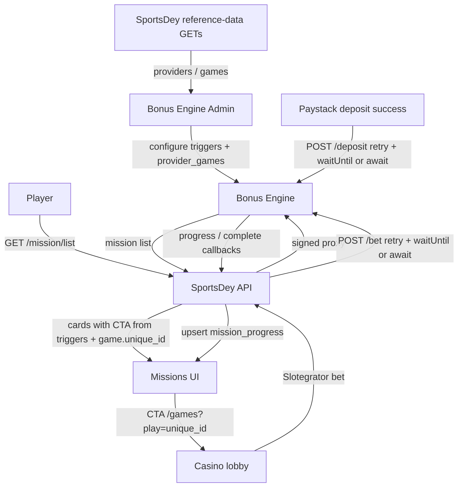

# Bonus Engine

Merchant adapter integrating SportsDey with the iGlobalSoft Bonus Engine for loyalty, missions, player bonuses, and tournaments / (later) jackpots.

Vendor docs portal: [`bonus-engine/`](../../bonus-engine/index.html) (OpenAPI at `bonus-engine/data/openapi.json`).

## Glossary

| Term | Meaning |
|------|---------|
| Merchant Adapter | SportsDey backend module that signs outbound REST calls and hosts inbound callbacks |
| `client_id` / `project_id` | Admin-issued credentials scoping keys, campaigns, and callbacks |
| Access token | Short-lived JWT from `POST /access_token`, sent as `Token` header |
| Signature | Base64 RSA-SHA256 over the **exact** JSON body bytes |
| Loyalty points | Accrued from configured earn rules on bets/deposits; redeemable for rewards |
| Mission | Play objective on allow-listed games / sports levels; progress inferred from `/bet` (and deposit) events. Sports rules match Sport, Category, or League (`league_id` = Championship ID) |
| Mission CTA | Player UI button destination derived from `mission_triggers` + `provider_games.game.unique_id` — never from game title keywords |
| Bonus campaign | Admin offer (`list_active_campaign`) with reward amounts, wagering, product (casino/sports) |
| Bonus assignment | Player instance (`getall_User_bonus`); `_id` is `userbonus_id` for activate/cancel |
| Tournament | Bonus Engine competition from `POST /tournament/list` (project-scoped). Distinct from Data.Bet sportsbook championships |

## Key flows

### Player loyalty / missions (outbound)

1. Player hits SportsDey `GET /loyalty/{points,history,lists}`, `GET /mission/list`, or `GET /tournament/list` with session.
2. Adapter mints/caches access token, signs body with merchant private key.
3. Adapter proxies to Bonus Engine feature routes and returns the engine payload.
4. Active loyalty campaigns come from Bonus Engine `POST /loyalty/lists` with project-scoped body `{ client_id, project_id }` (no `user_id`).
5. Tournament list is the same project-scoped body against Bonus Engine `POST /tournament/list`. Cards use `tournament_code` (then game name) when `tournament_name` is blank. Join is `POST /tournament/join` with `{ project_id, client_id, tournamentId, user_id }`; the featured tournament’s leaderboard is `POST /tournament/leaderboard`.

Loyalty Club UI/BFF details: [`docs/loyalty/README.md`](../loyalty/README.md).

Player bonuses: [`docs/bonuses/CONTEXT.md`](../bonuses/CONTEXT.md).

Player sync via `POST /login` runs on real app sign-in (email/OAuth Better Auth session create + phone OTP), not on mission/loyalty reads. The engine returns HTTP 200 with a JSON `status` (410/411/413 are failures). Unknown `user_id`s currently get `411 PLAYER_NOT_FOUND`; `/login` does not create the backoffice player.

### Mission play → score → UI

1. Admin configures a mission (trigger type, amounts, rewards, allow-listed games).
2. SportsDey hosts casino catalog for Admin dropdowns (`/bem/api/.../casino/...`).
3. Player opens Missions; UI normalizes each row: CTA from **trigger type** first, then deep-link to the first `provider_games[].game[].unique_id` on `/games?play=...`. Game **names** are never used to choose Sports vs Casino (avoids “Football Golden Cup” → sportsbook).
4. Player plays:
   - Casino: Slotegrator `action=bet` → SportsDey reports `POST /bet` (`product_type=casino`, `provider_id`, `game_id`).
   - Sportsbook: Data.Bet `/bet/accept` → SportsDey reports `POST /bet` (`product_type=sportsbook`, `sport_id`, `event_id`, `league_id`). `league_id` is the Data.Bet tournament / Championship ID. Do not send `category_id`. The engine matches the deepest Admin level configured (Sport, Category, or League) from `sport_id` + `league_id`.
5. Successful wallet deposits report `POST /deposit`.
6. Bonus Engine evaluates rules and POSTs mission progress/complete callbacks; SportsDey stores snapshots. On **mission complete**, if `reward.type` is **Real Cash**, SportsDey credits the main wallet (idempotent `be_mission_reward:{missionId}:{userId}`).

### Admin test: sportsbook mission (league-level)

Sportsbook Admin dropdowns list Soccer plus the European top 6 championships. Championship IDs come from Data.Bet tournament ids when the sportsbook proxy is configured (fallback stub ids `100`–`105` only if that lookup fails). Individual fixtures are not catalogued.

| Field | Value to pick |
|-------|----------------|
| Trigger | **Bet on specific provider/game/sport/odd/market/event** (or **Bet X and Get X** / **Wager X and Get X** scoped to sportsbook) |
| Sport | **Soccer** (`SportId: 1`) |
| Category (optional) | **England** (`10`) |
| Championship (optional) | **Premier League** (Data.Bet tournament id; do not pin Event) |
| Event | Leave empty — Sport / Category / League rules all match from `sport_id` + `league_id` (`category_id` is not sent) |
| Amount | e.g. wager / min bet `100` |
| Reward | **Real Cash** `50` (to exercise wallet credit) |

CTA for that trigger goes to `/sportsbetting`. Place any Premier League (or configured league) bet ≥ amount; on accept we report `sport_id`, `league_id`, and live `event_id`. When the engine marks the mission complete with Real Cash, the wallet is credited.

### Gamification / bonus callbacks (inbound)

1. Bonus Engine POSTs to `{SERVER_URL}`:
   - Loyalty / missions: `/gamification/callback/...`
   - Wallets: `POST /bonus-engine/callback/balance`
   - Bonus status: `POST /bonus-engine/callback/updateBonus`
   - Bonus assignment: `POST /bonus-engine/callback/bonusAllocation`
2. Adapter verifies `Signature` with `BONUS_ENGINE_CALLBACK_PUBLIC_KEY`.
3. Invalid signature → **413** `INVALID_SIGNATURE` (do not process). Missing required fields → **410**.
4. Persist idempotency key; on first delivery update local snapshot tables. ACK **200** after side effects succeed.
5. Mission complete with Real Cash credits the main wallet first; wallet-missing / credit failure returns **502** so Bonus Engine can retry.
6. `updateBonus` applies amount **changes** only (never engine absolute balances). Positive `bonus_amount_change` debits `game_wallet`. Debits clamp at 0. Idempotent `be_bonus_status:{bonusId}:{userId}:{STATUS}:{real|bonus}`.
7. `bonusAllocation` stores the assignment. If `user_action=ACTIVATED` or `status=ACTIVE`, credit uses the same `be_bonus_activate:...` keys as player activate (no double credit).
8. `GET /bonus/list` overlays `bonus_engine_user_bonus` snapshots onto the engine list.

### Reference data (merchant-hosted, Admin dropdowns)

Bonus Engine Admin loads Providers / Games / Sports / Markets from **SportsDey-hosted** GETs (same paths as vendor swagger under `/bem/api/BonusEngine/bonus-engine/...`). Auth uses header `X-Secure-Data` = RSA-SHA256(Base64) over the literal string `X-Secure-Data`.

Casino providers/games come from D1 `game.provider_id` / `game.provider_name` (filled by Slotegrator catalog sync). Until sync has run, `GET .../casino/game-providers` returns `[]` — never placeholder ids. Refresh catalog via signed `POST .../casino/sync-catalog` (Worker-side Slotegrator fetch) or `pnpm games:sync` from an allowlisted host. Sportsbook championships are the European top 6 (Premier League, La Liga, Serie A, Bundesliga, Ligue 1, UEFA Champions League). Event/market GETs return `[]`; do not pin fixtures.

Mission list responses may still include `provider.unique_id: "provider_id"` / `provider.name: "provider_name"`. Those literals come from **Bonus Engine Admin / vendor data**, not from SportsDey inventing placeholders — chase the Bonus Engine team to store real provider unique ids when configuring missions. SportsDey CTAs key off `provider_games[].game[].unique_id` (and trigger type), not provider display names.

## Invariants

- Never re-serialize JSON after signing; sign the same string that is the HTTP body.
- Private key never leaves server secrets (`.dev.vars` / Cloudflare secrets).
- Callbacks are idempotent: duplicate deliveries return 200 without double-applying side effects.
- Mission complete with **Real Cash** credits the main wallet once (reference-keyed) **before** ACK; credit/wallet failure returns 502 so Bonus Engine can retry. Points rewards are not wallet-credited here.
- `updateBonus` / `bonusAllocation` money side effects run **before** ACK; wallet-missing / apply failure returns **502**. Engine absolute wallet figures are never written.
- Casino bets, sportsbook accepts, and Paystack deposits are reported to Bonus Engine with retries (`waitUntil`, or awaited if `waitUntil` is missing); reporting failures must not fail the player wallet path.
- Mission CTA must not keyword-match sports on casino game titles.
- Bonus activate credits SportsDey wallets from assignment amounts (`bonus_amount` → game wallet, `cash_amount` → main wallet) and is idempotent; engine-returned balances are never written.

## Env

See `apps/server/.env.example` (`BONUS_ENGINE_*`). Admin **Callback URL** origin = `SERVER_URL`.

## Pointers

- Service: `apps/server/src/services/bonus-engine/`
- Player routes: `apps/server/src/routes/loyalty.ts`, `mission.ts`, `bonus.ts`, `tournament.ts`
- Casino bet report: `apps/server/src/routes/slotegrator.ts` (`action=bet`)
- Sportsbook bet report: `apps/server/src/routes/sportsbook.ts` (`/bet/accept`)
- Real Cash / bonus wallet credit: `apps/server/src/services/bonus-engine/rewards.service.ts` (mission-complete, bonus activate, `updateBonus` amount changes)
- Deposit report hook: `apps/server/src/routes/wallet.ts` (Paystack success)
- Callbacks: `apps/server/src/routes/bonus-engine-callbacks.ts`
- Reference data: `apps/server/src/routes/bonus-engine-reference-data.ts`
- Missions UI normalize / CTA: `apps/web/src/lib/missions-normalize.ts`
- Missions docs: [`docs/missions/README.md`](../missions/README.md)
- Loyalty docs: [`docs/loyalty/README.md`](../loyalty/README.md)
- Bonuses docs: [`docs/bonuses/CONTEXT.md`](../bonuses/CONTEXT.md)
- Tournaments docs: [`docs/tournaments/CONTEXT.md`](../tournaments/CONTEXT.md)
- Schema: `bonus_engine_callback_event`, `bonus_engine_loyalty_snapshot`, `bonus_engine_mission_progress`, `bonus_engine_user_bonus`, `game.provider_*`
