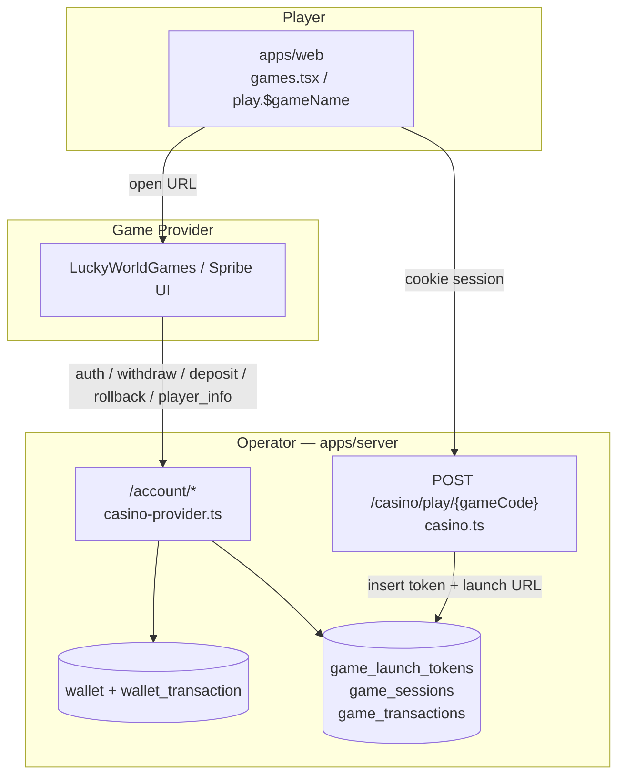
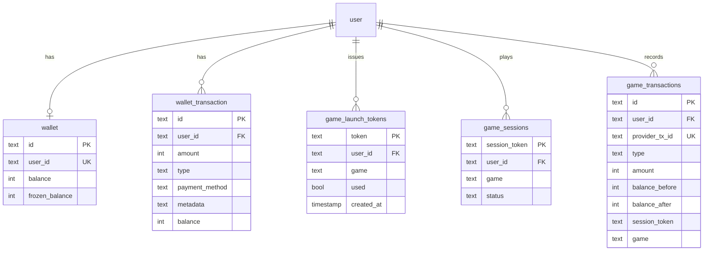
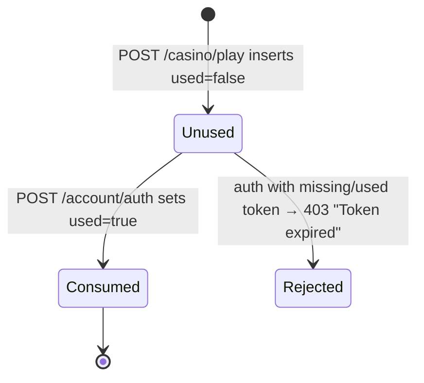
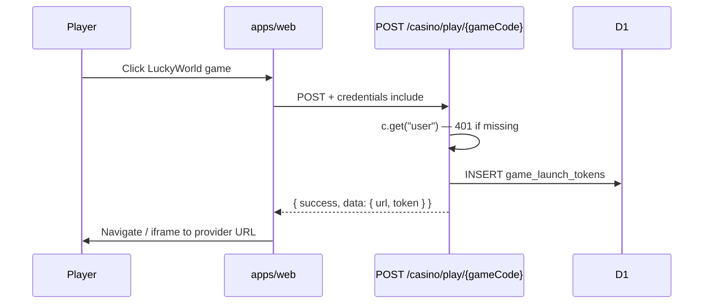
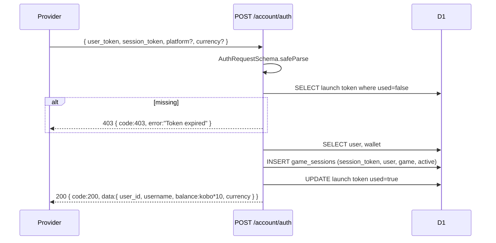
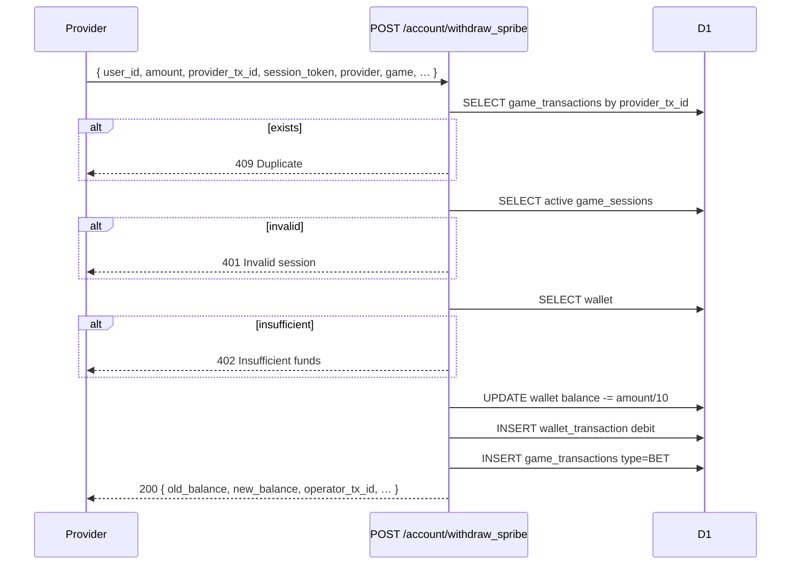
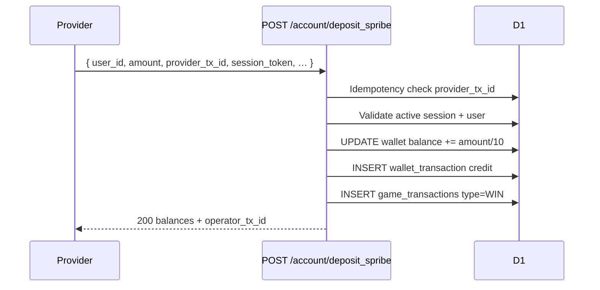
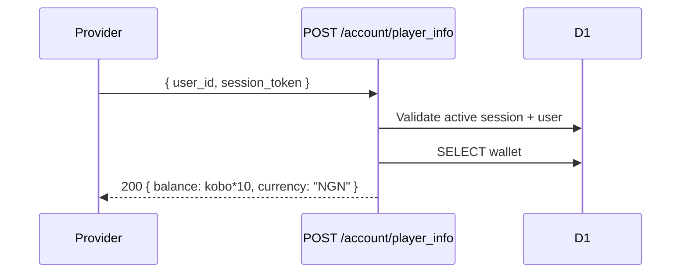
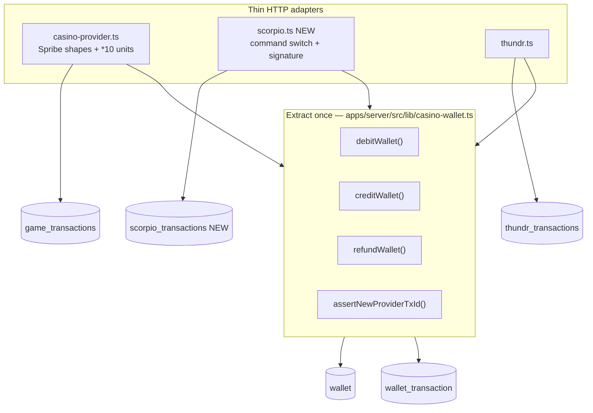
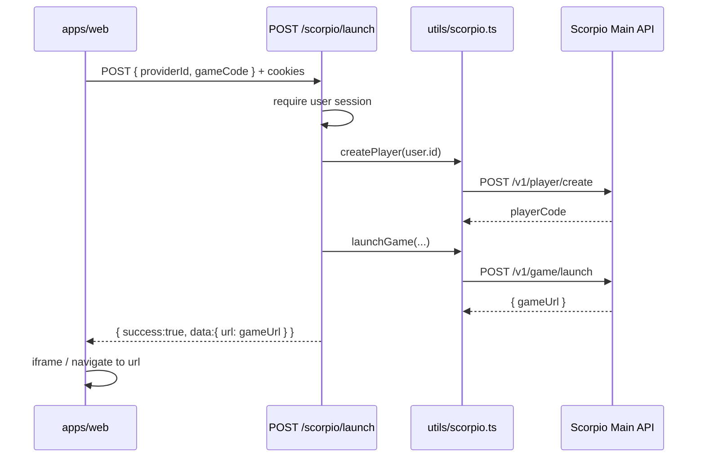

# Casino Provider Architecture (Spribe / LuckyWorld)

Living documentation. **Source of truth:** implementation under `apps/server`.  
Related narrative: root [`casino_game_flow.md`](../casino_game_flow.md).  
Multi-provider index: [`casino-providers.md`](./casino-providers.md).

---

## Executive summary

Sportsdey’s “casino provider” integration under `/account` is an **operator-wallet** adapter for **LuckyWorldGames**, using a **Spribe-shaped** HTTP contract (`*_spribe` path names).

It is **not** a generic multi-provider framework. Thndr, Slotegrator, and Pockets are separate route modules. Scorpio Play should follow that pattern and share extracted wallet helpers — not extend `casino-provider.ts`.



---

## 1. How Spribe / LuckyWorld works end-to-end

### Actors

| Actor | Role |
|-------|------|
| Player browser | Picks a game, opens provider URL in iframe/tab |
| `apps/web` | Authenticated launch call to our API |
| `apps/server` | Issues launch token; serves provider callbacks; owns balance |
| LuckyWorld / Spribe | Hosts game UI; calls our `/account/*` for money |

### Money rule

- **Game runs on the provider**
- **Balance lives in our D1 `wallet`** (kobo integers)
- Provider amounts use **millunits**: `1 NGN = 1000 provider units`  
  Conversion in code: `providerUnits = kobo * 10` and `kobo = round(providerAmount / 10)`

### Happy path

1. Logged-in user clicks a LuckyWorld game (`XCAPEHB`, `EAGLEHB`, `LUCKYRISEHB` on the web).
2. Web → `POST /casino/play/{gameCode}` with cookies.
3. Server inserts `game_launch_tokens`, returns launch URL pointing at LuckyWorld.
4. Browser opens provider; provider does **not** trust the player yet.
5. Provider → `POST /account/auth` with `user_token` (launch token) + its `session_token`.
6. Server creates `game_sessions`, marks launch token `used`, returns `user_id` + balance.
7. Bets → `POST /account/withdraw_spribe` (debit).
8. Wins → `POST /account/deposit_spribe` (credit).
9. Errors → `POST /account/rollback_spribe` (reverse).
10. Balance polls → `POST /account/player_info`.

### Frontend routing (how launch is chosen)

In `apps/web/src/routes/games.tsx` / `play.$gameName.tsx`:

- Codes `XCAPEHB` | `EAGLEHB` | `LUCKYRISEHB` → `POST {VITE_SERVER_URL}casino/play/{code}`
- Other “known” minigames → Thndr
- `LAGOSRUSH` → Lagos Rush launcher
- Everything else → Slotegrator

---

## 2. Database tables involved

Defined in `apps/server/src/db/schema.ts`.

### Core (this integration)

| Table | Purpose |
|-------|---------|
| `user` | Player identity (`user_id` returned to provider) |
| `wallet` | Balance + `frozen_balance` in **kobo**; one row per user |
| `wallet_transaction` | Human/ops ledger of debits/credits/refunds |
| `game_launch_tokens` | One-time launch tokens |
| `game_sessions` | Active provider `session_token` ↔ user ↔ game |
| `game_transactions` | Provider-facing casino ledger (`BET` / `WIN` / `ROLLBACK`) |

### Catalog (lobby only — not settlement)

| Table | Purpose |
|-------|---------|
| `game` / `category` / `game_category` | Lobby listing; no `provider` column |

### Entity relationship



---

## 3. Schemas used

### Launch (player → operator)

File: `apps/server/src/schemas/casino.ts`

| Schema | Used by |
|--------|---------|
| `GamePlayRequestSchema` | Path param `gameCode` |
| `GamePlayResponseSchema` | `{ success, data: { url, token } }` |
| `GamePlayErrorSchema` | Errors |
| `CasinoTransactionSchema` / `TransactionsResponseSchema` | `GET /casino/transactions` |

### Provider callbacks (provider → operator)

File: `apps/server/src/schemas/casino-provider.ts`

| Schema | Endpoint |
|--------|----------|
| `AuthRequestSchema` / `AuthResponseSchema` | `POST /account/auth` |
| `WithdrawRequestSchema` / `CasinoWithdrawResponseSchema` | `POST /account/withdraw_spribe` |
| `DepositRequestSchema` / `DepositResponseSchema` | `POST /account/deposit_spribe` |
| `RollbackRequestSchema` / `RollbackResponseSchema` | `POST /account/rollback_spribe` |
| `PlayerInfoRequestSchema` / `PlayerInfoResponseSchema` | `POST /account/player_info` |
| `CasinoProviderErrorSchema` | `{ code, error }` errors |

Re-exported from `apps/server/src/schemas/index.ts`.

### Response envelope difference

| Surface | Shape |
|---------|-------|
| `/casino/*` (player API) | `{ success, data }` — matches web `apiRequest` |
| `/account/*` (provider API) | `{ code, data }` or `{ code, error }` — Spribe-style |

---

## 4. Which files register these routes

```mermaid
flowchart LR
  index["apps/server/src/index.ts\nexport default app"]
  routes["apps/server/src/routes/route.ts"]
  casino["casino.ts"]
  provider["casino-provider.ts"]

  index -->|app.route('/', routes)| routes
  routes -->|routes.route('/casino', …)| casino
  routes -->|routes.route('/account', …)| provider
```

| Step | File | What it does |
|------|------|----------------|
| 1 | `apps/server/src/index.ts` | Creates `OpenAPIHono`, CORS, Better Auth, session middleware; `app.route("/", routes)` |
| 2 | `apps/server/src/routes/route.ts` | `routes.route("/casino", casinoRoute)` and `routes.route("/account", casinoProviderRoute)` |
| 3 | `apps/server/src/routes/casino.ts` | Defines `/play/{gameCode}`, `/transactions` |
| 4 | `apps/server/src/routes/casino-provider.ts` | Defines `/auth`, `/withdraw_spribe`, `/deposit_spribe`, `/rollback_spribe`, `/player_info` |

### Effective URLs

| Method | Path | Handler file |
|--------|------|--------------|
| `POST` | `/casino/play/{gameCode}` | `casino.ts` |
| `GET` | `/casino/transactions` | `casino.ts` |
| `POST` | `/account/auth` | `casino-provider.ts` |
| `POST` | `/account/withdraw_spribe` | `casino-provider.ts` |
| `POST` | `/account/deposit_spribe` | `casino-provider.ts` |
| `POST` | `/account/rollback_spribe` | `casino-provider.ts` |
| `POST` | `/account/player_info` | `casino-provider.ts` |

Docs note: `casino_game_flow.md` writes `/api/account/...`. The Hono mount is **`/account`**, not `/api/account`. Session middleware skips `path.startsWith("/api/account/")` — that prefix does **not** match `/account/...`, so Better Auth session attach still runs; callbacks ignore `c.get("user")` and use tokens instead.

---

## 5. How game launch tokens work

Table: `game_launch_tokens`

| Column | Role |
|--------|------|
| `token` PK | Opaque string `launch_{timestamp}_{random}` |
| `userId` | Owner |
| `game` | Game code at launch time |
| `used` | One-time flag (default `false`) |
| `createdAt` | Issued time |

### Lifecycle



**Create** (`casino.ts`):

```ts
const token = `launch_${Date.now()}_${Math.random().toString(36).slice(2, 15)}`;
await db.insert(schema.gameLaunchTokens).values({
  token, userId: user.id, game: gameCode, used: false,
});
const launchUrl = `${baseUrl}/${gameCode}?user=${user.id}&token=${token}&currency=NGN&operator=HALLABET`;
```

- `baseUrl` = `env.LUCKYWORLDGAMES_LAUNCH_URL` or `https://play.luckyworldgames.com/launch`

**Consume** (`casino-provider.ts` auth):

- Lookup `token === user_token AND used === false`
- On success: create session, then `used = true`
- No expiry column — “expired” in the 403 message really means missing/already used

**Authorization for launch:** Better Auth user via `c.get("user")` (player must be logged in).

---

## 6. How game sessions work

Table: `game_sessions`

| Column | Role |
|--------|------|
| `sessionToken` PK | Provider’s session id from auth body |
| `userId` | Bound player |
| `game` | Copied from launch token |
| `status` | Default `"active"` (code only checks `"active"`) |
| `createdAt` / `updatedAt` | Timestamps |

### Lifecycle

1. **Created** only in `/account/auth` with provider-supplied `session_token`.
2. **Validated** on withdraw / deposit / rollback / player_info:

```ts
eq(gameSessions.sessionToken, session_token),
eq(gameSessions.userId, user_id),
eq(gameSessions.status, "active"),
```

3. **Never closed** in current code — no logout/end-session handler sets `status` to inactive.

Sessions are the **authorization** mechanism for money callbacks after auth (not Better Auth cookies).

---

## 7. How wallet transactions work

Table: `wallet_transaction` — shared product ledger (Paystack, transfers, casino, etc.).

For this provider, each money move also writes a row:

| Callback | `type` | `paymentMethod` | `amount` | Metadata highlights |
|----------|--------|-----------------|----------|---------------------|
| withdraw (bet) | `debit` | `"lucky games"` | kobo bet | `game`, `sessionToken`, `providerTxId`, `action: "bet"` |
| deposit (win) | `credit` | `"lucky games"` | kobo win | `action: "win"` |
| rollback | `refund` | `"lucky games"` | signed adjustment | `action: "rollback"` |

`balance` column stores **wallet balance after** the operation (kobo).

`wallet.balance` is updated in the same handler (debit/credit). There is **no** Drizzle/SQL transaction wrapping wallet update + both inserts — failure mid-way can leave partial writes.

---

## 8. How game transactions work

Table: `game_transactions` — casino-specific idempotent ledger.

| Column | Role |
|--------|------|
| `id` | Operator tx id (`gtxn_…`) |
| `providerTxId` | **Unique** provider id (idempotency key) |
| `type` | `BET` \| `WIN` \| `ROLLBACK` |
| `amount` | kobo |
| `balanceBefore` / `balanceAfter` | kobo snapshots |
| `sessionToken` | Links to `game_sessions` |
| `game` | Game code |

### Idempotency

- BET/WIN: if `provider_tx_id` already exists → **409 Duplicate transaction**
- ROLLBACK: looks up original by `rollback_provider_tx_id`; new row uses `providerTxId: rollback_${originalId}`
- No explicit “already rolled back” guard on the original BET/WIN row

### Amount conversion

```
amountKobo = Math.round(providerAmount / 10)
responseBalance = kobo * 10
```

---

## 9. Complete request flows

### 9a. Launch (player)



### 9b. Auth



### 9c. Withdraw (BET)



### 9d. Deposit (WIN)



### 9e. Rollback

```mermaid
sequenceDiagram
  participant Prov as Provider
  participant API as POST /account/rollback_spribe
  participant DB as D1

  Prov->>API: { user_id, amount, rollback_provider_tx_id, session_token, … }
  API->>DB: SELECT game_transactions where provider_tx_id = rollback_provider_tx_id
  alt not found
    API-->>Prov: 404 Transaction not found
  end
  API->>DB: Validate session
  Note over API: If original BET → credit; if WIN → debit
  API->>DB: UPDATE wallet
  API->>DB: INSERT wallet_transaction refund
  API->>DB: INSERT game_transactions type=ROLLBACK provider_tx_id=rollback_{id}
  API-->>Prov: 200 balances
```

**Known bug:** rollback metadata uses `providerTxId: provider_tx_id` but that variable is not defined in the handler (should be `rollback_provider_tx_id`).

### 9f. Player info



---

## 10. Integrating Scorpio Play without duplicating business logic

### What not to do

- Do **not** add Scorpio handlers into `casino-provider.ts`.
- Do **not** reuse `/withdraw_spribe` paths or Spribe Zod schemas.
- Do **not** blindly reuse `game_launch_tokens` / `game_sessions` — Scorpio seamless mode uses `playerId` + signed callbacks (`command: balance|bet|win|cancel`), not launch-token auth.

### What the repo already does for “new providers”

Follow **Thndr / Slotegrator / Pockets**:

1. New route module
2. New Zod schemas
3. Own ledger table(s) (or carefully generalized ledger)
4. Mount in `route.ts`
5. Wire frontend launch switch
6. Share **`user` + `wallet`** only

### Clean architecture (recommended)



### Scorpio module sketch

| Piece | Location |
|-------|----------|
| Launch | `POST /scorpio/launch` → call Scorpio `POST /v1/game/launch` |
| Player link | Scorpio `POST /v1/player/create` (on login or first launch) |
| Callbacks | `POST /scorpio/callback` — switch on `command` |
| Auth | Verify `X-Request-Signature` |
| Ledger | `scorpio_transactions` with unique `transactionId`, `roundId`, `type` |
| Env | API token, callback secret, Scorpio base URL in Wrangler secrets |

### Map Scorpio commands → shared helpers

| Scorpio `command` | Helper | Ledger type |
|-------------------|--------|-------------|
| `balance` | read wallet | — |
| `bet` | `debitWallet` | BET |
| `win` | `creditWallet` | WIN |
| `cancel` | `refundWallet` / reverse | CANCEL/ROLLBACK |

Adapter owns: signature check, Zod parse, statusCode mapping (`OK`, `ERR_NOT_ENOUGH_MONEY`, …), unit conversion if Scorpio differs from kobo.

### Files to add/change for Scorpio

**Add:** `routes/scorpio.ts`, `schemas/scorpio.ts`, schema tables + migration, optional `lib/casino-wallet.ts`, `utils/scorpio-signature.ts`  

**Change:** `routes/route.ts`, Wrangler/env secrets, web launch switches (`games.tsx`, `play.$gameName.tsx`, `PopularAndCasinoSection.tsx`), optionally `admin-tickets.ts`

**Leave alone:** `casino-provider.ts` (LuckyWorld remains stable)

---

## Scorpio Play Main API — where each endpoint belongs

> **Critical:** `/v1/provider/list`, `/v1/game/list/:providerId`, `/v1/player/create`, `/v1/player/info`, `/v1/game/launch`, `/v1/game/kick` are **Scorpio’s** Main API.  
> We **call them as the operator**. We do **not** implement Hono routes at those exact paths.  
> Our public surface follows existing convention: `/scorpio/...` (like `/slotegrator/launch`, `/lagos-rush/launcher`).

There is **no** service layer to extend (`services/` does not exist on the server). Outbound HTTP lives in:

- `apps/server/src/utils/*.ts` (Paystack, Monnify, Africa’s Talking) — preferred for reusable clients
- or inline `fetch` in the route (Slotegrator launch, Lagos Rush launcher)

Closest reusable abstraction: `fetchWithTimeout` in `apps/server/src/utils/fetch-with-timeout.ts`. No Axios/HTTP class.

### Recommended file layout (matches repo)

```
apps/server/src/
  utils/scorpio.ts          # outbound Main API: listProviders, listGames, createPlayer, …
  schemas/scorpio.ts        # Zod for OUR /scorpio/* request/response envelopes
  routes/scorpio.ts         # Hono: launch, kick, optional admin catalog proxies
  cli/sync-scorpio-games.ts # optional: provider/list + game/list → seed `game` table
```

Mount: `routes/route.ts` → `routes.route("/scorpio", scorpioRoute)`.

Env (Wrangler secrets / `.env`, same style as `SLOTEGRATOR_*` / `LAGOS_RUSH_*`):

| Variable | Purpose |
|----------|---------|
| `SCORPIO_API_URL` | Base URL for Main API (e.g. `https://…`) |
| `SCORPIO_BASE_URL` | Alias for `SCORPIO_API_URL` |
| `SCORPIO_API_TOKEN` | Bearer token **and** HMAC key for `X-Request-Signature` |
| `SCORPIO_CALLBACK_URL` | Public Seamless callback URL registered with Scorpio (e.g. `https://api.example.com/scorpio/callback`) |
| `SCORPIO_SERVER_IP` | Operator public server IP (informational / Scorpio portal) |
| `SCORPIO_ALLOWED_IPS` | Comma-separated allowlist for callback source IPs (empty = disabled) |

### Seamless Wallet callback

| Piece | Location |
|-------|----------|
| Endpoint | `POST /scorpio/callback` |
| Config | `utils/scorpio-config.ts` |
| Signature + IP | `utils/scorpio-security.ts` (HMAC-SHA512 Base64, `timingSafeEqual`) |
| Wallet logic | `utils/scorpio-callback.ts` (`balance` / `bet` / `win` / `cancel`) |
| Ledger | `scorpio_transactions` |

Callbacks always respond **HTTP 200** with `{ balance?, statusCode }` per Scorpio Seamless protocol. Invalid signature → `ERR_INTEGRITY_CHECK_FAILED`; blocked IP → `ERR_NOT_AUTHENTICATED`. Secrets and signatures are never logged.


### Per Scorpio endpoint

#### `GET /v1/provider/list`

| Question | Answer |
|----------|--------|
| Belongs where? | **Client:** `utils/scorpio.ts` → `listProviders()`. **Caller:** CLI sync (primary) and/or admin-only Hono route if UI needs it. **Not** a player-facing web route. |
| Extend existing service? | **No** service exists. Closest analog: `cli/sync-games.ts` calling Slotegrator catalog. |
| Frontend flow? | None for players. Admin/ops only, or offline seed. |
| Cleanest impl | Function in `utils/scorpio.ts` using `fetch`/`fetchWithTimeout` + Bearer; CLI writes providers into DB or logs IDs for `game/list`. |

#### `GET /v1/game/list/:providerId`

| Question | Answer |
|----------|--------|
| Belongs where? | `utils/scorpio.ts` → `listGames(providerId)`. Seed into `game` table via CLI (like Slotegrator sync) or admin import. Lobby still reads `GET /games` (`routes/games.ts`). |
| Extend existing? | Do **not** put Scorpio fetch inside `games.ts`. That route is our catalog CRUD/list. Sync is separate (CLI). |
| Frontend flow? | Player: `GET /games` (our DB) → play → Scorpio launch. Catalog sync is offline/admin. |
| Cleanest impl | CLI `sync-scorpio-games.ts` loops providers → game list → insert/update `game` (+ categories). Mirror `cli/sync-games.ts`. |

#### `POST /v1/player/create`

| Question | Answer |
|----------|--------|
| Belongs where? | `utils/scorpio.ts` → `createPlayer(playerExternalId)`. Called from **`POST /scorpio/launch`** before `/v1/game/launch` (idempotent link). Optional: also on first login later. |
| Extend existing? | No. Lagos Rush sends `playerId` inline in launcher; Slotegrator sends `player_id` on init. Same idea — ensure player exists at launch time. |
| Frontend flow? | Web → `POST /scorpio/launch` → server calls create then launch → returns `{ url }` → iframe. Player never calls Scorpio directly. |
| Cleanest impl | Inside launch handler: `createPlayer(user.id)` then `launchGame(...)`. Store `playerCode` only if you need it (optional column/table); Scorpio docs say use `playerExternalId` thereafter. |

#### `POST /v1/player/info`

| Question | Answer |
|----------|--------|
| Belongs where? | `utils/scorpio.ts` → `getPlayerInfo(...)`. Optional `GET /scorpio/player` for admin/debug. Not required on every launch if create is idempotent. |
| Extend existing? | No. |
| Frontend flow? | Usually none. |
| Cleanest impl | Utility only until an admin screen needs it. |

#### `POST /v1/game/launch`

| Question | Answer |
|----------|--------|
| Belongs where? | **Our** `POST /scorpio/launch` in `routes/scorpio.ts` wraps Scorpio’s `/v1/game/launch`. Schema in `schemas/scorpio.ts`. Body includes `providerId`, `gameCode`, `returnUrl`, etc.; `playerExternalId` = `user.id`. |
| Extend existing? | Do **not** extend `casino.ts` (LuckyWorld) or `slotegrator.ts`. New module, same response shape `{ success, data: { url } }` so web can reuse launch handling. |
| Frontend flow? | See diagram below. |
| Cleanest impl | Copy structure of `lagos-rush.ts` / `slotegrator.ts` launch: check `c.get("user")`, call util, return URL. |



#### `POST /v1/game/kick`

| Question | Answer |
|----------|--------|
| Belongs where? | **Our** `POST /scorpio/kick` in `routes/scorpio.ts` → `utils/scorpio.ts` `kickPlayer(playerExternalId)`. Callers: admin (suspend user), or product “force close session”. |
| Extend existing? | No kick analog today. Closest: admin user deactivate flows — wire kick as a side effect when suspending a player who may have an open Scorpio session. |
| Frontend flow? | Admin UI → our `/scorpio/kick` or `/admin/...` that calls util. Not the public games lobby. |
| Cleanest impl | Authenticated route (user self-kick or admin). Body `{ playerExternalId }` defaulting to session user id. |

### What not to implement as Hono `/v1/...`

Mounting Scorpio path names on our Worker would collide mentally with Scorpio’s API and break the `/slotegrator`, `/thndr`, `/casino` naming convention. Always prefix **our** API with `/scorpio`.

### HTTP client decision

| Option | In repo? | Use for Scorpio? |
|--------|----------|------------------|
| Shared HTTP client class | **No** | Don’t invent one |
| `fetchWithTimeout` | Yes | Yes for outbound calls |
| Raw `fetch` in route | Yes (Slotegrator, Lagos Rush) | OK for one-off; prefer util |
| `utils/paystack.ts` style | Yes | **Preferred** for Main API |

### Implementation status (Main API)

Implemented in-repo (Hono + Drizzle, matching Slotegrator/Lagos Rush):

| Layer | Path |
|-------|------|
| Outbound client | `apps/server/src/utils/scorpio.ts` |
| Zod / OpenAPI | `apps/server/src/schemas/scorpio.ts` |
| Routes | `apps/server/src/routes/scorpio.ts` mounted at `/scorpio` |
| Player map | `scorpio_players` table (`user_id` → `player_code`) |
| Migration | `apps/server/src/db/migrations/0023_scorpio_players.sql` |
| Env | `SCORPIO_API_URL` / `SCORPIO_BASE_URL`, `SCORPIO_API_TOKEN`, `SCORPIO_CALLBACK_URL`, `SCORPIO_SERVER_IP`, `SCORPIO_ALLOWED_IPS` |

**Our routes → Scorpio Main API**

| Our path | Scorpio |
|----------|---------|
| `POST /scorpio/launch` | `player/create` (if needed) + `game/launch` |
| `POST /scorpio/kick` | `game/kick` |
| `GET /scorpio/providers` | `provider/list` |
| `GET /scorpio/providers/settings` | `provider/settings` |
| `GET /scorpio/providers/:id/settings/:currency` | `provider/settings/{id}/{currency}` |
| `GET /scorpio/games/:providerId` | `game/list/{providerId}` |
| `GET /scorpio/player` | `player/info` |
| `GET/POST/PATCH /scorpio/operator` | `operator/info\|create\|update` |
| `GET /scorpio/transactions` | `transaction/list` |
| `GET /scorpio/transactions/round` | `transaction/round` |
| `POST /scorpio/bonus-call/register\|cancel` | bonus-call register/cancel |
| `GET /scorpio/bonus-call/:issueId` | bonus-call detail |

Player launch flow persists `playerCode` in `scorpio_players`. Errors map documented Scorpio codes via `ScorpioApiError`. Logging uses `console.log` (same as other routes); tokens are never logged.

Apply migration: `cd apps/server && pnpm run db:push` (or Wrangler D1 migrations). Set secrets before calling.

### Catalog integration audit (2026-07-22)

**Verdict: ❌ Scorpio games are not integrated into the lobby/catalog.**

Verified in-repo:

| Source | Scorpio games? |
|--------|----------------|
| Live Scorpio `GET /v1/game/list/:providerId` | Source of truth — **not snapshotted in repo**; no local credentials to count |
| `cli/sync-games.ts` | **Slotegrator only** |
| `cli/seed-games.ts` | 11 hardcoded non-Scorpio games |
| `cli/casino_games.json` | Category name lists (~1055 unique) — **not Scorpio API payloads** |
| `game` table schema | `id, name, code, image_url, enabled` — **no provider / scorpio fields** |
| SQL migrations | Only `scorpio_players` (user↔playerCode), **no game rows** |
| `GET /games` | Returns our `game` table — **no Scorpio filter/marker** |
| Frontend launch | LuckyWorld / Lagos Rush / Thndr / **default Slotegrator** — **never `/scorpio/launch`** |

**Counts:** Total Scorpio games = unknown without API credentials. Integrated Scorpio catalog games = **0**. Missing = **all**.

---

## Important types / shapes (quick reference)

```ts
// Provider success
{ code: 200, data: { user_id, balance /* millunits */, … } }

// Provider error
{ code: 400|401|402|403|404|409, error: string }

// Game tx types
type GameTxType = "BET" | "WIN" | "ROLLBACK"

// Wallet tx types used here
type WalletTxType = "debit" | "credit" | "refund"
```

Hono context for player launch: `user` / `session` from Better Auth (`apps/server/src/types.ts`).

---

## Common pitfalls

1. Confusing `/casino` (player, `{success,data}`) with `/account` (provider, `{code,data}`).
2. Treating `game_*` tables as shared across all casino providers — they are LuckyWorld-oriented.
3. Assuming launch tokens expire by time — only `used` is checked.
4. Double-counting money: always convert with `/10` and `*10` consistently.
5. Middleware skip for `/api/account/` does not match real `/account` paths.
6. Rollback metadata bug (`provider_tx_id` undefined).
7. No session end / no DB transaction atomicity.

---

## Debugging tips

1. After launch: row in `game_launch_tokens` with `used=0`.
2. After auth: token `used=1`, row in `game_sessions`.
3. After bet: `wallet` down; `wallet_transaction` debit; `game_transactions` BET with unique `provider_tx_id`.
4. OpenAPI: `http://localhost:3000/docs` — tags **Casino** and **Casino Provider**.
5. Reproduce provider calls with curl using session_token from auth response.
6. Admin ticket views union `game_transactions` labeled as Spribe (`admin-tickets.ts`).

---

## Related modules

| Module | Path |
|--------|------|
| Launch | `apps/server/src/routes/casino.ts` |
| Callbacks | `apps/server/src/routes/casino-provider.ts` |
| Schemas | `apps/server/src/schemas/casino.ts`, `casino-provider.ts` |
| Tables | `apps/server/src/db/schema.ts` |
| Mount | `apps/server/src/routes/route.ts` |
| App shell | `apps/server/src/index.ts` |
| Web launch | `apps/web/src/routes/games.tsx`, `play.$gameName.tsx` |
| Other providers | `thundr.ts`, `slotegrator.ts`, `pockets.ts`, `lagos-rush.ts` |
| Narrative doc | `casino_game_flow.md` |

---

## Suggested next steps

1. Extract `lib/casino-wallet.ts` from `casino-provider.ts` (and optionally Thndr/Pockets).
2. Implement Scorpio adapter against their callback test suite.
3. Add `provider` column to `game` to stop hardcoding launch routing by game code.
